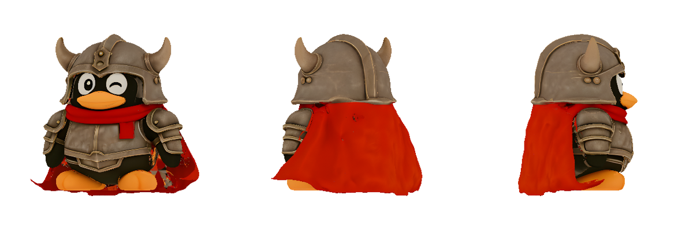
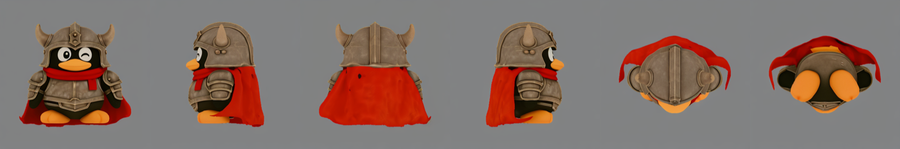

# Hunyuan3D-Swift

A native [MLX-Swift](https://github.com/ml-explore/mlx-swift) port of Tencent's
[Hunyuan3D](https://github.com/Tencent-Hunyuan/Hunyuan3D-2) image-to-3D pipelines, running
entirely on Apple silicon — pure Swift, no Python, no PyTorch, no CUDA in the path. Two
libraries and one CLI take a single reference image all the way to a textured GLB on-device:

- **`Hy3DMLX`** — shape generation: DiT flow-matching + ShapeVAE geo-decoder + DINOv2
  image conditioning + marching cubes.
- **`HunyuanPaintMLX`** — texture painting: SD2.1 multiview diffusion (RGB and PBR), xatlas
  UV unwrap, rasterize/bake, EDT + Navier-Stokes inpaint, and RealESRGAN ×4 super-resolution.
- **`hy3d`** — a CLI that runs either stage or chains them (`image → textured GLB`).

Both libraries are verified against the [Python MLX ports](#parity-measured) by
threshold-gated parity fixtures. Those Python ports are themselves parity-verified against
the reference PyTorch/CUDA implementation, so the Swift port sits at the end of a
double-checked chain back to the original models.

<p align="center">
  
</p>
<p align="center">
  <em>Image → shape → PBR texture, produced end-to-end by <code>hy3d generate</code> on an M4 Max.</em>
</p>

## Quick start

### 1. Build

```bash
swift build -c release            # builds the hy3d CLI
swift build                       # debug
```

Requires a recent Swift toolchain (Xcode 16+) on Apple silicon.

### 2. Download weights

Weights are **not** bundled. Four public Hugging Face repos hold the MLX-converted
checkpoints — download only the ones you need:

| Repo | Contents |
|---|---|
| [`zimengxiong/hunyuan3d-mlx-shape-small`](https://huggingface.co/zimengxiong/hunyuan3d-mlx-shape-small) | shape · `2mini` (0.6B) |
| [`zimengxiong/hunyuan3d-mlx-shape-large`](https://huggingface.co/zimengxiong/hunyuan3d-mlx-shape-large) | shape · `2.0-turbo` (1.1B) |
| [`zimengxiong/hunyuan3d-mlx-paint-small`](https://huggingface.co/zimengxiong/hunyuan3d-mlx-paint-small) | paint · `v2-0` RGB |
| [`zimengxiong/hunyuan3d-mlx-paint-large`](https://huggingface.co/zimengxiong/hunyuan3d-mlx-paint-large) | paint · `paintpbr-v2-1` PBR |

With the Hugging Face CLI:

```bash
hf download zimengxiong/hunyuan3d-mlx-shape-small --local-dir weights/shape-small
hf download zimengxiong/hunyuan3d-mlx-paint-large --local-dir weights/paint-large
```

or, without the CLI, fetch a file directly:

```bash
curl -L -o weights/shape-small/model.fp16.safetensors \
  https://huggingface.co/zimengxiong/hunyuan3d-mlx-shape-small/resolve/main/model.fp16.safetensors
```

(You can also convert the official Tencent checkpoints yourself; the loaders accept the same
directory layout.)

### 3. Generate

```bash
# image -> textured GLB (chained shape + paint), the one-liner:
swift run -c release hy3d generate photo.png -o out.glb \
    --shape-weights weights/shape-small --paint-weights weights/paint-large

# just the shape mesh:
swift run -c release hy3d shape photo.png -o mesh.glb --weights weights/shape-small

# paint an existing mesh (RGB or PBR):
swift run -c release hy3d paint mesh.glb photo.png -o textured.glb \
    --weights weights/paint-large --model pbr
```

`hy3d --help` lists every flag.

## Models

Full 2×2 lineup. Download sizes are the on-disk footprint; times are measured end-to-end on
an M4 Max (shape at octree 256; paint at 512 render / 15 steps with super-resolution, on an
undecimated mesh).

| Slot | Checkpoint | Params | Download | Time |
|---|---|---|---|---|
| **Shape · Small** | `hunyuan3d-dit-v2-mini` (30-step CFG) | 0.6B | ~3.8 GB | **20.9 s** |
| **Shape · Large** | `hunyuan3d-dit-v2-0-turbo` (8-step consistency, guidance-embed) | 1.1B | ~4.9 GB | **22.3 s** |
| **Paint · Small** | `hunyuan3d-paint-v2-0` (SD2.1 UNet, RGB, 2048 atlas) | — | ~3.9 GB | **231 s** |
| **Paint · Large** | `hunyuan3d-paintpbr-v2-1` (MDA+RA+MA+DINO+PoseRoPE, PBR, 4096 atlas) | — | ~8.7 GB | **344 s** |

Chained `generate` (shape + paint) measures ~240 s (small/RGB) and ~360 s (large/PBR)
end-to-end. The six multiview panels the paint stage denoises:

<p align="center">
  
</p>

## Parity (measured)

Every gate is a Swift XCTest that replays a Python-dumped fixture (deterministic seeds) and
asserts the **threshold** column; the **measured** column is the actual campaign result with
fixtures regenerated end-to-end across the full 2×2 lineup.

| Gate | Threshold | Measured |
|---|---|---|
| Shape DiT forward (mini) | cos ≥ 0.99999 | cos 1.0000000, maxabs 0 |
| Shape DiT forward (2.0-turbo, guidance-embed) | cos ≥ 0.99999 | cos 1.0000000, maxabs 0 |
| Shape DINOv2 | cos ≥ 0.9999 | cos 0.9999999, maxabs 0 |
| Shape VAE / geo-decoder grid | cos ≥ 0.9999 | cos 0.9999999, maxabs 0 |
| Sigmas (flow-match + consistency) | maxabs ≤ 1e-6 | 0 / 0 (exact) |
| Shape e2e mesh, mini (256 octree) | Chamfer/bbox ≤ 0.01 | 0.00260 (148 852 verts) |
| Shape e2e mesh, 2.0-turbo (256 octree) | Chamfer/bbox ≤ 0.01 | 0.00257 (150 430 verts) |
| Paint VAE encode / decode | maxabs ≤ 1e-6 | 0 / 0 (bit-exact) |
| DDIM trajectory | maxabs ≤ 1e-6 | 0 (bit-exact) |
| UniPC trajectory | maxabs ≤ 1e-5 | 3.6e-7 |
| SD2.1 UNet forward | maxabs ≤ 1e-4 | 3.2e-6 |
| PBR UNet forward (MDA+RA+MA+DINO+RoPE) | cos ≥ 0.9999 | cos 1.0000000, maxabs 8.2e-5 |
| RealESRGAN ×4 | maxabs ≤ 1e-6 | 0 (bit-exact) |
| Rasterizer face-id / bary | 100% / ≤ 2e-4 | 100% / 0 |
| Control maps (normal / position) | PSNR ≥ 80 dB | 167.3 dB / ∞ (bit-exact) |
| Bake (coverage / texture) | 100% / PSNR ≥ 100 dB | 100% / 151.3 dB |
| Inpaint (EDT nearest-fill + Navier-Stokes) | bit-exact | maxabs 0 (indices, fill, NS) |
| PoseRoPE fp16 voxel indices (4 levels, 512²) | exact | maxdiff 0, tables maxabs 0 |
| Paint RGB e2e (3-step, guidance 2.0) | cos ≥ 0.999 | cos 0.9999998 |
| Paint PBR e2e (3-step, guidance 3.0, self-computed RoPE) | cos ≥ 0.999 | cos 1.0000000 |

Notes: the inpaint implementation is an exact port of scipy's Euclidean feature transform
(including tie-breaking, verified index-exact on a real bake mask with ~10 k ties) and of
OpenCV's `INPAINT_NS` fast-marching estimator, so the whole fill is bit-identical to Python.
PoseRoPE voxel indices replicate numpy's fp16 accumulation exactly, so the PBR e2e gate runs
on Swift-computed RoPE tables (no injection).

## Performance

Measured on an M4 Max (`/usr/bin/time -l`, release build, weights resident):

| Run | Config | Wall time | Peak memory |
|---|---|---|---|
| `hy3d shape` (small) | 30-step CFG, octree 256 | 20.9 s | ~5.6 GB |
| `hy3d shape` (large) | 8-step turbo, octree 256 | 22.3 s | ~7.3 GB |
| `hy3d paint` (RGB) | 512 render, 15 steps, +SR | 231 s | ~38 GB |
| `hy3d paint` (PBR) | 512 render, 15 steps, 4096 atlas, +SR | 344 s | ~39 GB |
| `hy3d generate` (small / RGB) | chained | 240 s | ~25 GB |
| `hy3d generate` (large / PBR) | chained | 360 s | ~33 GB |

## Architecture

```
Sources/
  Hy3DMLX/                 # shape library
    DiT.swift              #   flow-matching transformer (CFG + guidance-embed variants)
    DINOv2.swift           #   image conditioning encoder
    VAE.swift              #   ShapeVAE + geo-decoder (config-driven scale_factor)
    Sampler.swift          #   flow-match / consistency sigmas
    MarchingCubes.swift    #   octree grid -> mesh (+ MCTables)
    Preprocess.swift       #   image -> conditioning
    ShapeGenerator.swift   #   end-to-end shape pipeline
    Pipeline.swift, Layers.swift, GLB.swift, Version.swift
  HunyuanPaintMLX/         # paint library
    UNet.swift             #   SD2.1 multiview UNet
    PBRAttention.swift     #   MDA + reference/multiview attention, PoseRoPE
    PBRWrapper.swift       #   PBR model wiring (self-computed voxel RoPE tables)
    Wrapper20.swift        #   RGB (v2-0) model wiring
    Dinov2.swift           #   PBR image conditioning
    Scheduler.swift        #   DDIM / UniPC
    VAE.swift              #   SD2.1 VAE
    Xatlas.swift           #   UV unwrap (via CXatlas)
    SwiftRaster.swift, MeshRender.swift   # rasterize + control maps
    Inpaint.swift          #   EDT nearest-fill + Navier-Stokes
    RealESRGAN.swift       #   ×4 super-resolution
    Pipeline.swift, MeshIO.swift, ImageX.swift, Layers2D.swift, Attention.swift, GLB.swift
  CXatlas/                 # vendored xatlas (C++) + thin C shim
  hy3d/                    # CLI
    Shape.swift, Paint.swift, Generate.swift   # subcommands
    Support.swift, main.swift                  # arg parsing, parity-shape / parity-paint panels
Tests/
  ShapeParityTests/        # threshold-gated, fixture-driven (XCTSkip when fixtures absent)
  PaintParityTests/
parity/                    # Python fixture dumpers + regeneration docs
```

## Testing & fixtures

```bash
swift test                                   # green with zero fixtures (all gates XCTSkip)
HY3D_FIXTURES=/path/to/fixtures swift test   # runs the threshold-gated parity gates
```

Fixtures are large and are not checked in. They are dumped from the Python MLX ports with the
scripts in [`parity/`](parity/) — the full 2×2 regeneration workflow, per-script fixture
inventory, and environment knobs are documented in [`parity/README.md`](parity/README.md).
The CLI can also print the parity panels directly:

```bash
swift run -c release hy3d parity-shape --fixtures ./fixtures \
    --weights weights/shape-small --weights-turbo weights/shape-large
swift run -c release hy3d parity-paint --fixtures ./fixtures
```

## License

`Hunyuan3D-Swift` source is **MIT** (see [`LICENSE`](LICENSE)). Vendored xatlas, the
`mlx-swift` dependency, the model weights, and the algorithm ports (scipy EDT, OpenCV
Navier-Stokes inpaint) carry their own licenses and attributions — see
[`THIRD_PARTY_LICENSES.md`](THIRD_PARTY_LICENSES.md). No model weights are redistributed in
this repository.

## History

This repository previously hosted the Python MLX pipeline for Hunyuan3D. That code is
preserved unchanged on the [`legacy-python`](../../tree/legacy-python) branch; this Swift
implementation supersedes it (same models, parity-verified against the Python port).
