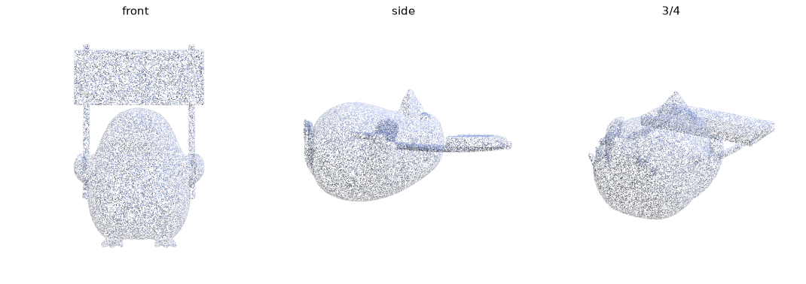

# Hunyuan3D-Shape — MLX

> **Reference implementation.** This is the known-good Python MLX shape port that the native
> [Hunyuan3D-Swift](../../README.md) package is parity-tested against. It sits in the middle of
> the parity chain: Swift ↔ this MLX port ↔ the torch/CUDA reference. Run everything below from
> `python/shape` via `uv run`.

Fully **MLX-native** Apple-Silicon image→mesh shape generator for the Hunyuan3D family
(`2mini` 0.6B · `2.0` 1.1B · `2.1` 3.3B MoE, plus turbo distilled variants).
**No PyTorch in the inference path** — torch exists only as a dev-time parity oracle.
Per-stage parity-verified vs the torch reference; weight quantization and FlashVDM-style
octree decode bring the bigger model to **~79 s / 3 GB** on a Mac, near-lossless.



*(penguin holding an "HY3D" sign — reconstructed from a single image, fully on MLX)*


*(generalization — plush toy, revolver, ornate staff, each via 2.0 with octree decode + 8-bit)*

One config-driven codebase spans three architectures (FLUX-style `Hunyuan3DDiT` and the
U-Net `HunYuanDiTPlain`+MoE; DINOv2-giant SwiGLU and DINOv2-large MLP conditioners) — adding a
model is download + config, no new loader code.

## What runs where

```
image ─rembg/preprocess(numpy/cv2)─► DINOv2-giant (MLX) ──┐ once
                                                          ▼
              ┌──────── MLX denoise loop (N × CFG) ────────┐
   noise ───► │ Hunyuan3DDiT velocity → CFG → Euler step   │ hot path
              └────────────────────────────────────────────┘
                                                          ▼
        ShapeVAE decode + dense SDF grid query (MLX) ─► grid (the one numpy hop)
                                                          ▼
        skimage marching cubes ─► trimesh ─► GLB
```

Every compute-heavy stage (DINOv2-giant conditioner, FLUX-style DiT, sampler, VAE
decoder + grid query) runs in MLX. The only host hop is the final SDF grid → numpy
for marching cubes.

**Input:** an RGBA image with the subject segmented (transparent background) — the standard
shape-gen input; the preprocessor recenters via the alpha mask. For an arbitrary photo, remove the
background first (e.g. `rembg`) — that's an upstream CPU step, kept out of the inference path.

## Setup

```bash
uv sync                                  # MLX runtime (Python 3.12)

# 2mini (bundled DiT+DINO+VAE safetensors), via ModelScope (HF was region-blocked here):
uv run python scripts/dl_modelscope.py

# any other model: scripts/dl_any.py <repo> <path> <out>, e.g. 2.0-standard:
uv run python scripts/dl_any.py Tencent-Hunyuan/Hunyuan3D-2 \
    hunyuan3d-dit-v2-0/model.fp16.safetensors \
    weights/Hunyuan3D-2/hunyuan3d-dit-v2-0/model.fp16.safetensors
```

Each model's `model.fp16.safetensors` is the full bundled checkpoint (`conditioner.` DINOv2 +
`model.` DiT + `vae.` ShapeVAE), split by prefix at load. (2.1 ships a `.ckpt` instead — convert
once with `scripts/convert_v21_ckpt.py`.)

## Models

One config-driven codebase loads three checkpoints (point `--weights` at the model dir
containing `config.yaml` + `model.fp16.safetensors`):

| model | weights dir | conditioner | DiT | notes |
|---|---|---|---|---|
| **2mini** | `Hunyuan3D-2mini/hunyuan3d-dit-v2-mini` | DINOv2-giant | FLUX 0.6B | small, fast |
| **2.0** | `Hunyuan3D-2/hunyuan3d-dit-v2-0` | DINOv2-giant | FLUX 1.1B | best detail (giant eyes + bigger DiT) |
| **2.0-turbo** ⭐ | `Hunyuan3D-2/hunyuan3d-dit-v2-0-turbo` | DINOv2-giant | FLUX 1.1B distilled | **fast+quality sweet spot** — 8 steps, ~17 s, ≈ base-2.0 |
| 2.1 | `Hunyuan3D-2.1/hunyuan3d-dit-v2-1` | DINOv2-large | MoE 3.3B | supported (`dit_plain.py`); large conditioner softens fine detail |
| mini-turbo | `Hunyuan3D-2mini/hunyuan3d-dit-v2-mini-turbo` | DINOv2-giant | FLUX 0.6B distilled | fast, but stripes thin features (too small to distill cleanly) |

Distilled (`*-turbo`) models are auto-detected (`guidance_embed` → single forward, no CFG;
consistency scheduler → run with `--steps 8`). All `weights dir` are under `weights/`.

Adding 2.0/2.1 required **no new loader code** — `convert.py` reads the DiT class and DINO FFN
type from each config.

## Generate

```bash
uv run python -m hy3dmlx.pipeline image.png --out out.glb \
    --weights weights/Hunyuan3D-2/hunyuan3d-dit-v2-0 \
    --steps 30 --guidance 5.0 --octree 256 --dtype float16 --quantize 4
```

```python
import mlx.core as mx
from hy3dmlx.pipeline import Hunyuan3DShapePipeline
pipe = Hunyuan3DShapePipeline.from_pretrained(
    "weights/Hunyuan3D-2/hunyuan3d-dit-v2-0", dtype=mx.float16, quantize=8)  # 8 | 4 | None
mesh = pipe.generate("image.png", num_inference_steps=30, octree_resolution=256)
mesh.export("out.glb")
```

### Which config?

| goal | command flags | model | ~time / RAM |
|---|---|---|---|
| **best quality** | `--octree-decode` | 2.0 | ~85 s / 6 GB |
| **fast + great quality** ⭐ | `--octree-decode --quantize 8 --steps 8` | 2.0-turbo | ~17 s / 4 GB |
| **smallest RAM** | `--octree-decode --quantize 4` | 2mini | ~25 s / 2.7 GB |
| **fastest draft** | `--octree-decode --steps 6` | mini-turbo | ~15 s (stripes thin detail) |

Speed/memory flags (all near-lossless, stack together):
- `--quantize 8|4` — quantize the DiT + DINO block linears (VAE/norms/embedders stay fp16).
  8-bit is near-lossless; 4-bit cuts weights ~3.5× and *speeds up* the bigger model's denoise.
- `--octree-decode` — FlashVDM-style octree decode: query only the near-surface band (~5 % of
  cells) instead of the full grid → **5–10× faster grid query** (the dominant cost), Chamfer
  ~0.4 % of bbox vs dense.

Together on 2.0: **254 s / 6.4 GB → 79 s / 3.2 GB**, near-lossless. See
[BENCHMARKS.md](BENCHMARKS.md) for the full time/memory/quality matrix.

## Package layout

| file | role |
|---|---|
| `hy3dmlx/layers.py` | shared primitives: fp32 LayerNorm/RMSNorm, SDPA, GELU(tanh/erf), SwiGLU, Fourier/timestep embedders |
| `hy3dmlx/models/dit.py` | `Hunyuan3DDiT` — FLUX-style double + single stream, adaLN modulation, RMS QK-norm, **no RoPE / no MoE** (2mini, 2.0) |
| `hy3dmlx/models/dit_plain.py` | `HunYuanDiTPlain` — U-Net DiT, self+cross-attn per block, LIFO skips, MoE (8 experts/top-2 + shared) (2.1) |
| `hy3dmlx/models/shape_vae.py` | ShapeVAE decode (`post_kl → 16× transformer → geo_decoder`) + dense grid query |
| `hy3dmlx/models/dinov2.py` | DINOv2-giant ViT + SwiGLU FFN |
| `hy3dmlx/sampler.py` | FlowMatchEulerDiscrete loop (CFG) |
| `hy3dmlx/convert.py` | bundled safetensors → MLX modules (prefix split; only DINO patch Conv2d transposed NCHW→NHWC) |
| `hy3dmlx/preprocess.py` | ImageProcessorV2 recenter/resize + DINO ImageNet transform |
| `hy3dmlx/pipeline.py` | orchestration + the single grid→numpy→marching-cubes boundary |

## MLX Swift (native macOS/iOS app)

For a Mac App Store / on-device app, the inference must be **MLX Swift**, not Python. The native
port lives at the repository root — the [`Hunyuan3D-Swift`](../../README.md) Swift package — built
against [`mlx-swift`](https://github.com/ml-explore/mlx-swift) and loading the **same
`.safetensors`** weights. The `Hunyuan3DDiT` forward is **bit-identical to this Python reference**
(`cosine 1.0000000, maxabs 0.0`); the remaining modules (VAE+octree, DINOv2, sampler) follow the
same transcription, gated against the fixtures dumped here (see [`../../parity`](../../parity)).

## Tests

```bash
uv run pytest tests/test_layers.py tests/test_sampler.py tests/test_octree.py   # fast, no weights
uv run pytest tests/test_models.py                                              # weight-backed gates
```

Fast tests gate the primitives (norms, GELU, timestep/Fourier embedders, SwiGLU) against numpy
reference formulas and the sampler schedules (flow-match + consistency) against the reference
numerics. Weight-backed tests gate per-model load (zero missing keys) + finite forwards,
quantized forwards, and that octree decode is near-lossless vs dense (end-to-end Chamfer).

## Parity (vs torch oracle, identical inputs, fp32)

Run `scripts/oracle_compare.py` (oracle venv) then `scripts/mlx_compare.py`:

| stage | metric |
|---|---|
| DINOv2-giant | cosine **1.000000** |
| DiT (30-step trajectory) | cosine **0.999968**, std 1.0193 vs 1.0192 |
| ShapeVAE grid (identical latents) | maxabs **0.0000** |

### Parity landmines resolved
- **VAE `scale_factor` = 1.0188137142395404** read from config (the on-disk 2.1 `z_scale 1.0039…` is a decoy); divided at decode entry.
- **`geo_decoder.ln_post` eps = 1e-5** (torch LayerNorm default) while every other norm is 1e-6.
- **time embedding `max_period`**: the torch reference calls `timestep_embedding(t, 256, self.time_factor)` *positionally*, so `time_factor` (1000) lands in the `max_period` slot — effective `max_period = 1000`, not the 10000 default. Getting this wrong corrupts all adaLN modulation (the bug that first produced a fragmented mesh).

## Benchmark (M-series, fp32, octree 256, 30 steps)

| stage | time |
|---|---|
| DINOv2-giant conditioning | 0.4 s |
| 30 denoise steps (× CFG) | ~11 s |
| VAE decode + 257³ grid | ~54 s |
| marching cubes + export | ~10 s |
| **total** | **~65 s** |

The VAE dense grid query dominates; FlashVDM octree decode (sparse, top-k) is the main
remaining speed lever, along with 4-bit quantization of the DiT/DINO linears.
